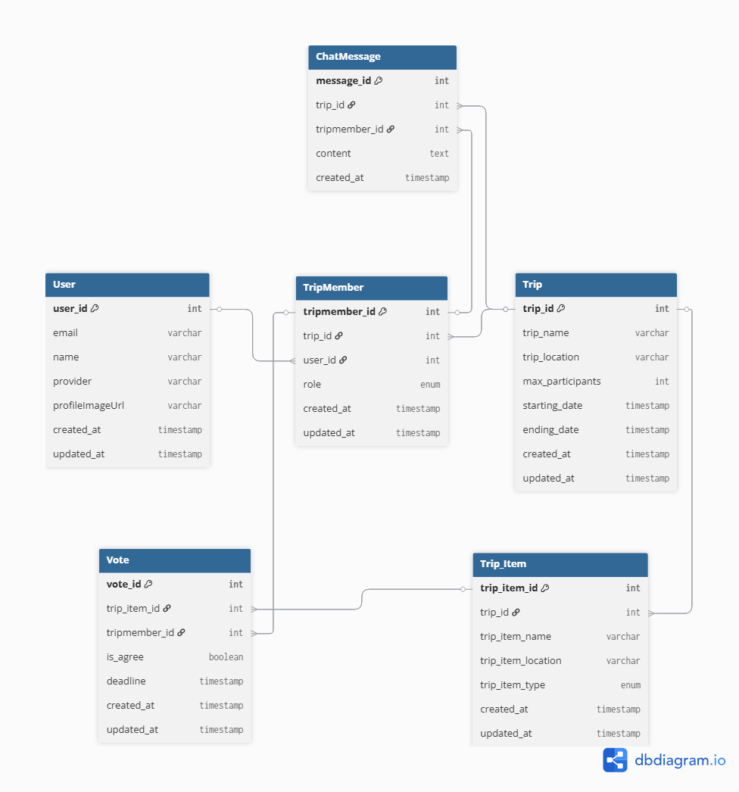

# Link 🔗

> **"여행의 시작, 함께하는 설렘을 더하다"**

여행 준비 시 참여자-주최자 간 양방향 소통 서비스.  
의견 충돌 없이 카테고리별 정보 제공과 **투표 기반 의사결정**으로 여행 계획을 효율적으로 조율합니다.

> 포트폴리오용 풀스택 웹 애플리케이션 (개인 프로젝트)

---

## 기술 스택

### Backend
| 분류 | 기술 |
|------|------|
| Framework | Spring Boot 4, Spring MVC |
| ORM | Spring Data JPA (Hibernate) |
| 인증 | Spring Security, OAuth2 Client, JWT (jjwt 0.12.6) |
| DB | MySQL 8.0 (Docker) |
| 빌드 | Maven, Java 21 |

### Frontend
| 분류 | 기술 |
|------|------|
| UI | React 19, TypeScript 6 |
| 빌드 | Vite 8 |
| 라우팅 | React Router v7 |
| 상태 관리 | Zustand |
| HTTP 클라이언트 | Axios |

### Deployment
- AWS (예정)

---

## 주요 기능

| 기능 | 설명 |
|------|------|
| Google 소셜 로그인 | OAuth2 + JWT 기반 인증 |
| 여행 생성 / 초대 | 주최자가 여행을 만들고 참여자 초대 |
| 카테고리별 항목 관리 | 숙소, 식당, 관광지 등 카테고리로 후보 등록 |
| 투표 기반 의사결정 | 참여자 찬반 투표로 여행 항목 결정 |
| 실시간 채팅 | 여행 그룹 내 채팅 (WebSocket 예정) |
| 캘린더 뷰 | 여행 일정 시각화 |

---

## 프로젝트 구조

```
Link/
├── backend/                        # Spring Boot
│   └── src/main/java/com/link/
│       ├── domain/
│       │   ├── common/             # BaseEntity (createdAt, updatedAt)
│       │   ├── user/               # User 엔티티, Repository
│       │   ├── trip/               # Trip, TripMember, TripItem 엔티티
│       │   ├── vote/               # Vote 엔티티
│       │   └── chat/               # ChatMessage 엔티티
│       ├── security/               # JWT, OAuth2 인증 처리
│       └── config/                 # Security 설정
│
└── frontend/                       # React + TypeScript
    └── src/
        ├── pages/                  # 화면 컴포넌트 (URL 대응)
        │   └── trip/
        ├── components/             # 재사용 UI 컴포넌트
        │   ├── home/
        │   └── trip/
        ├── router/                 # React Router 설정
        ├── store/                  # Zustand 전역 상태
        ├── api/                    # Axios 클라이언트
        ├── hooks/                  # 커스텀 훅 (비즈니스 로직)
        └── types/                  # TypeScript 타입 정의
```

---

## 시작하기

### 사전 요구사항
- Java 21
- Docker
- Node.js 20+

### Backend 실행

```bash
# MySQL 컨테이너 실행
docker-compose up -d

# Spring Boot 실행
cd backend
./mvnw spring-boot:run
```

### Frontend 실행

```bash
cd frontend
npm install
npm run dev
```

---

## ERD



---

## 진행 현황

### ✅ 완료

**Backend**
- 전체 도메인 Entity 설계 및 구현 (User, Trip, TripMember, TripItem, Vote, ChatMessage)
- Google OAuth2 + JWT 인증 구현 (Spring Security, OAuth2SuccessHandler, JwtAuthFilter)
- Docker MySQL 환경 구성

**Frontend**
- React Router v7 라우팅 구조 설정 (createBrowserRouter, Layout/Outlet 패턴)
- Zustand 인증 상태 관리, Axios HTTP 클라이언트 (JWT interceptor)
- Tailwind CSS v4 디자인 토큰 설정 (`@theme` 시맨틱 컬러 변수)
- SplashPage, LoginPage (Google OAuth redirect, fade-in 애니메이션)
- HomePage — Calendar (주간/월간 스와이프 토글), EmptyTripView
- BottomNav — Union.png 커스텀 배경, Plus FAB, 말풍선, 탭 알림 배지
- TripCreateModal — 5단계 바텀시트 (대기 → 이름 → 날짜 → 멤버 → 확인), 별 float 애니메이션
- TripDatePickerModal — 날짜 범위 선택 캘린더, 범위 연결 배경 밴드 시각화

### 🔄 진행 중
- TripMemberModal (멤버 추가 바텀시트)
- SplashPage 토큰 확인 → 자동 라우팅

### 📋 예정
- OAuth 콜백 페이지 (백엔드에서 JWT 수신)
- TripDetailPage, TripVotePage, TripChatPage, MyPage
- 여행 생성 / 초대 REST API (컨트롤러 / 서비스 레이어)
- 투표 API
- WebSocket 실시간 채팅
- AWS 배포 (EC2, RDS, S3)
